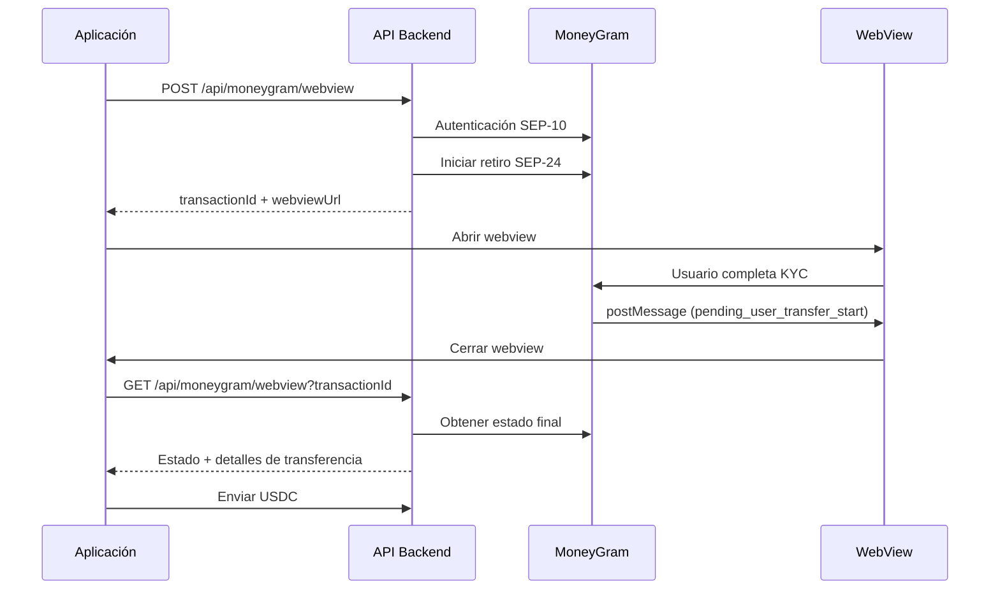
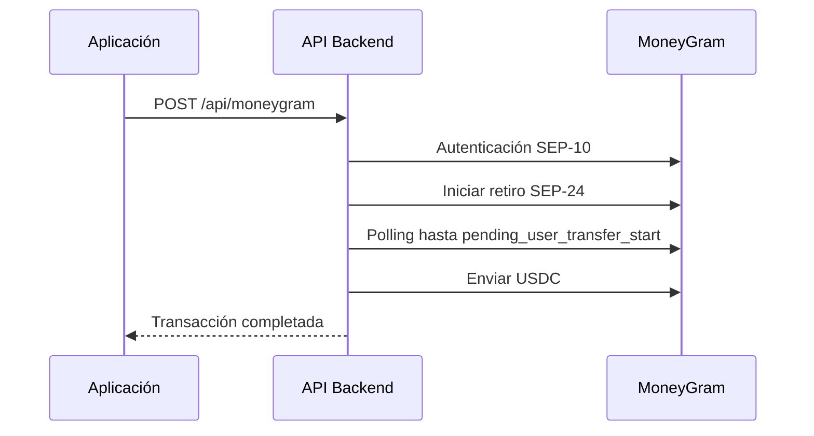

# Arquitectura del Sistema Chipi Offramp

## Main Modules

### 1. Stellar Account (`src/lib/stellar/account.ts`)
**Responsability**: Create and Manage Stellar Accounts
- Crear nuevas cuentas Stellar
- Fondear cuentas con XLM mínimo
- Establecer trustlines para USDC
- Encriptar claves privadas

**Funciones principales**:
- `createStellarAccountWithTrustline()`: Crea cuenta + trustline USDC

### 2. Stellar Payments (`src/lib/stellar/payments.ts`)
**Responsabilidad**: Send USDC payments on Stellar
- Enviar USDC a cuentas destino
- Manejar memos de transacción
- Gestionar fees de red

**Funciones principales**:
- `sendUSDCToDestination()`: Send USDC with memo

### 3. MoneyGram Auth (`src/lib/moneygram/auth.ts`)
**Responsabilidad**: SEP-10 Auth with MoneyGram
- Autenticación usando la librería oficial
- Manejo de tokens de autenticación
- Configuración de testnet/producción

**Funciones principales**:
- `authenticateWithMoneyGram()`: SEP-10 Auth

### 4. MoneyGram Transactions (`src/lib/moneygram/transactions.ts`)
**Responsabilidad**: SEP-24 Transactions with MoneyGram
- Iniciar transacciones de retiro
- Monitorear estado de transacciones
- Manejar callbacks de estado
- Polling robusto con timeout

**Funciones principales**:
- `initiateMoneyGramWithdrawal()`: Inicia retiro
- `monitorMoneyGramTransaction()`: Monitorea transacción
- `getTransactionStatus()`: Obtiene estado actual
- `getTransactionsForAsset()`: Lista todas las transacciones

## Endpoints API

### 1. `/api/stellar/create-account` (POST)
**Propósito**: Crear cuenta Stellar con trustline USDC
```json
{
  "pin": "1234"
}
```

### 2. `/api/moneygram/withdraw` (POST)
**Propósito**: Iniciar retiro con MoneyGram (sin crear cuenta)
```json
{
  "amount": "100",
  "userId": "user123"
}
```

### 3. `/api/moneygram/status` (GET)
**Propósito**: Consultar estado de transacción
```
/api/moneygram/status?transactionId=abc123
```

### 4. `/api/moneygram/webview` (POST)
**Propósito**: Start Webview flow with MoneyGram
```json
{
  "amount": "100",
  "userId": "user123"
}
```

**Respuesta:**
```json
{
  "success": true,
  "transactionId": "abc123",
  "webviewUrl": "https://extstellar.moneygram.com?...",
  "instructions": {
    "openInWebview": true,
    "listenForPostMessage": true,
    "expectedStatus": "pending_user_transfer_start"
  }
}
```

### 5. `/api/moneygram/webview` (GET)
**Propósito**: Verify status after postMessage
```
/api/moneygram/webview?transactionId=abc123
```

### 6. `/api/moneygram` (POST)
**Propósito**: Full Flow (crear cuenta + retiro)
```json
{
  "pin": "1234",
  "amount": "100",
  "userId": "user123"
}
```


### 1. **Flujo con Webview (Recomendado)**


### 2. **Flujo Automático (Sin Webview)**


## Estados de Transacción MoneyGram

1. **`incomplete`** - Transacción iniciada, procesando
2. **`pending_user_transfer_start`** - ✅ **Listo para recibir USDC**
3. **`pending_user_transfer_complete`** - USDC recibido, procesando
4. **`completed`** - ✅ **Transacción completada**
5. **`error`** - ❌ **Error en la transacción**

## Configuración

### Variables de Entorno Requeridas
```env
# Stellar
STELLAR_FUNDER_SECRET_KEY=your_funder_secret_key

# MoneyGram
MONEYGRAM_AUTH_SECRET_KEY=your_auth_secret_key
MONEYGRAM_FUNDS_SECRET_KEY=your_funds_secret_key
```

### Configuración Centralizada (`src/lib/config.ts`)
- Configuración de Stellar (URLs, USDC, etc.)
- Configuración de MoneyGram (testnet/producción)
- Configuración de la aplicación

## Execution Sequence

### **Flujo con Webview (Recomendado para UX)**
1. **Iniciar webview**: `POST /api/moneygram/webview`
2. **Abrir webview**: Usar componente `MoneyGramWebView`
3. **Esperar postMessage**: Usuario completa KYC
4. **Verificar estado**: `GET /api/moneygram/webview?transactionId`
5. **Enviar USDC**: Usar endpoint de pagos

### **Flujo Automático (Para testing)**
1. **Flujo completo**: `POST /api/moneygram`
2. **Monitorear estado**: `GET /api/moneygram/status?transactionId`

## Beneficios de la Arquitectura

### ✅ Modularidad
- Cada módulo tiene una responsabilidad específica
- Fácil de testear individualmente
- Reutilizable en diferentes contextos

### ✅ Mantenibilidad
- Código limpio y bien documentado
- Separación clara de responsabilidades
- Fácil de debuggear

### ✅ Escalabilidad
- Endpoints específicos para cada funcionalidad
- Configuración centralizada
- Fácil agregar nuevas funcionalidades

### ✅ Flexibilidad
- Puedes usar endpoints individuales o el flujo completo
- Soporte para webview y flujo automático
- Fácil cambiar entre testnet y producción

## Próximos Pasos

1. **Testing**: Crear tests unitarios para cada módulo
2. **WebSockets**: Implementar monitoreo en tiempo real
3. **Logging**: Agregar sistema de logs estructurado
4. **Métricas**: Implementar métricas de performance
5. **Documentación**: Documentar APIs con OpenAPI/Swagger
6. **UI/UX**: Mejorar la experiencia del webview 